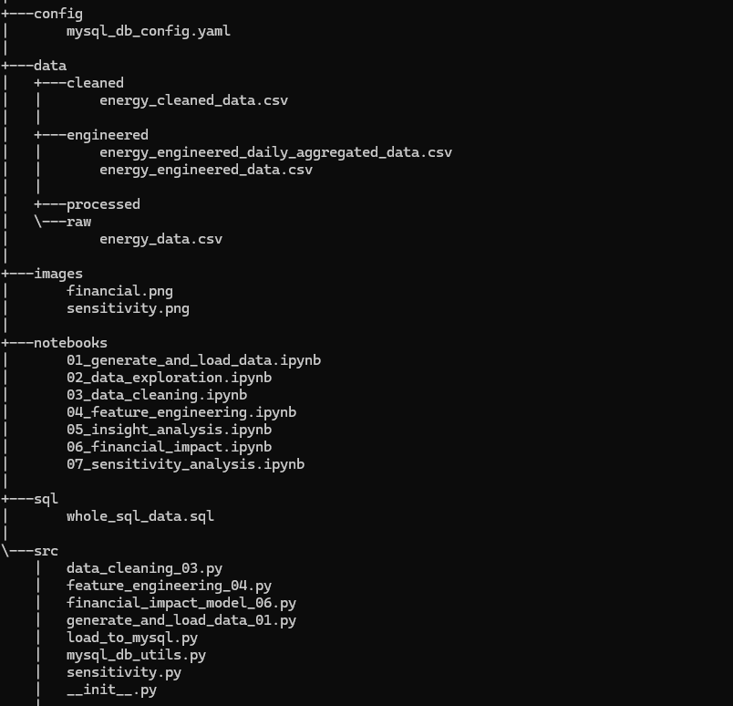
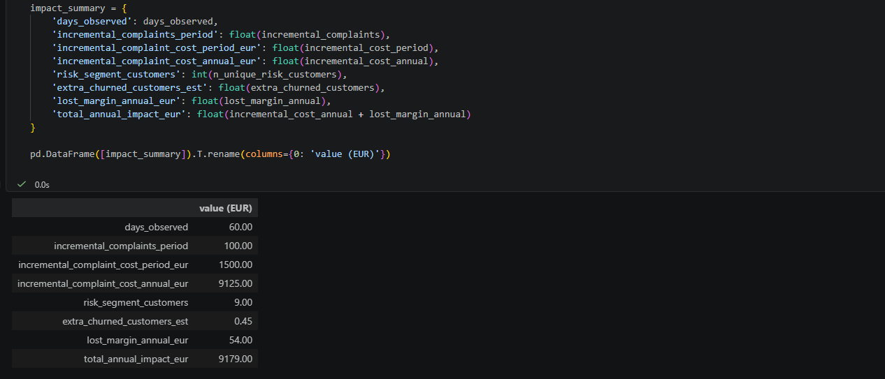
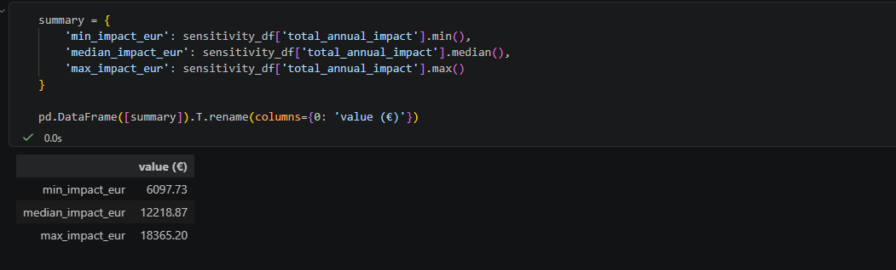

## `Outages, Tariffs and Customer Trust - An End-to-End Energy Analytics Case Study`

 **We have seen a rise in billing complaints and customer dissatisfaction in some regions and in this project, a raw data export from the data warehouse representing real-time business transaction dataset. No further instructions are provided and you are required to tell us what matters and what we should do, create a scenario that impact energy decision-making.**

 ### 📌 `Project Overview`

 This project simulates a real‑world energy analytics case study similar to what top `energy, utilities, and data‑driven` companies use in this evolving data-driven energy business.

The simulated energy dataset are messy raw export from an energy provider’s data warehouse with no instructions, no guidance, and the goal is to produce energy-driven business insights.

The goal of this project is to demonstrate:

- Business thinking

- Analytical judgement

- Communication clarity

- Technical execution (Python + SQL)

And the project walks through the following:

- Synthetic dataset creation

- Exploratory inspection ("Read before you Touch")

- Data cleaning using Python and SQL

- Feature engineering

- Insight generation

- Financial impact estimation

- Sensitivity analysis

- Business recommendations

### 🧠 `Business Problem`
A retail energy supplier has seen a rise in billing complaints and customer dissatisfaction, especially in certain regions. They want to understand:

- What drives complaints?

- Are outages related?

- Do tariff types influence customer behaviour?

- What is the financial impact?

- What actions should the business take?

##### **Business-Oriented Schema Design**

This schema guides the creation of the project data warehouse:

- Table: energy_usage_raw

- customer_id: customer identifier

- region: geographic region ('North', 'South', 'East', 'West')

- meter_id: meter identifier

- timestamp_utc: reading timestamp

- kwh: energy consumed in that interval

- tariff_plan: 'fixed' or 'variable'

- is_smart_meter: 0/1

- outage_minutes_last_24h: minutes of outage in last 24 hours

- bill_amount_eur: billed amount for that billing period (synthetic)

- complaint_flag: 0/1 whether customer raised a billing complaint

*Injected messiness to the energy dataset and they include:*

- Missing region

- Negative or zero kwh

- Duplicate rows

- Outliers in kwh and bill_amount_eur

### `File Structure`

### 🧹 `Data Cleaning with Python and SQL`
**Cleaning steps included:**

- Removing duplicates

- Replacing negative kWh with NULL

- Filling missing regions as “Unknown”

- Capping extreme bills at 99.5th percentile

- Normalising timestamps

### 🏗️ `Feature Engineering`
**Key features created:**

- daily_kwh

- daily_outage_minutes

- daily_bill_eur

- any_complaint

- high_outage_day (≥ 15 minutes)

- hour, weekday, is_peak_hour

- Data was aggregated to customer‑day level for business relevance.

### 📈 `Core Insight`
**Fixed-tariff and Variable‑tariff customers in the North region complain at nearly 64% and 85% respectively on high‑outage days.**

- This is a decision‑changing insight because it links:

    - Tariff design

    - Reliability

    - Customer trust

    - Operational cost

### 💶 `Financial Impact Estimation`

In this analysis, I quantified:

Operational cost = Incremental complaints * Cost per complaint

Churn cost = Extra churned customers * Annual margin

Total annual impact = Complaint cost + Lost margin

The following results were obtained:

**€9.1k/year** in extra complaint handling

**€54/year** in lost margin

**€9–10k/year** total impact

Consequently, If similar patterns exist in other regions or tariff types, the group‑wide impact could be multiples of this figure.

In the North region, fixed-tariff and variable‑tariff customers on high‑outage days generate about `65%` and `84%` complaint rate respectively.

### 📊 `Sensitivity Analysis`

In the project, I varied:

`Cost per complaint (€10–€30)`

`Churn uplift (2%–8%)`

`Annual margin (€80–€160)`

Results:

- Minimum impact: €6k+/year

- Median impact: €12k+/year

- Maximum impact: €18k+/year

Note: 👉 The problem remains financially material under all assumptions.

### 🧭 `Business Recommendations`

From the entire project, I have made the following recommendations:

1. Improve communication for both fixed-tariff and variable‑tariff customers especially in high‑outage regions.

2. Proactive bill explanations after outages as this reduce perceived unfairness.

3. Review compensation policies, small credits can reduce complaints and churn.

4. Monitor this segment as a priority risk cohort = High‑outage * (fixed-tariff +variable‑tariff) customers are fragile.

5. Investigate root causes of outages in the North - operational reliability improvements may yield high return on investment (ROI).

### 🧾 Executive Summary

Fixed-tariff and Variable‑tariff customers in the North region complain are significant on high‑outage days and hence drastic measures need to be implemented.

This behaviour creates an estimated €9–10k annual financial impact through increased complaint handling and churn‑related margin loss. The combination of price variability and perceived unreliability is eroding customer trust. I recommend targeted communication, proactive bill explanations after outages, and monitoring this segment as a priority churn‑risk group.

